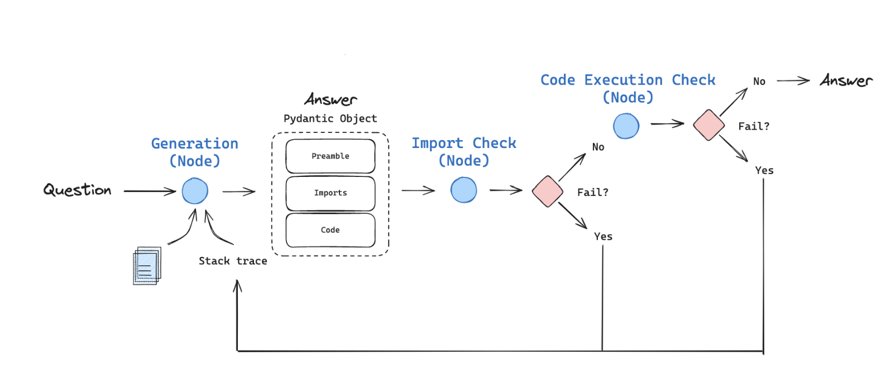

# Lorax: Tree-Sequence Analysis with LLMs

Query based Code Generation and Analysis of Tree-Sequence using LLM.

## Overview

The goal is to leverage Large-language Models(LLM) to generate code and analyze tree-sequences using tskit by simply asking questions in plain English. With Retrieval-Augmented Generation (RAG), users can input questions in plain English, and the system will generate executable tskit code to answer these queries.

## Installation

1. Create and activate a conda environment:
```bash
conda create -n treesequences python=3.10
conda activate treesequences
```

2. Install dependencies:
```bash
pip install -r requirements.txt
```

3. Download required data:
- Create a folder "src/data"
- Download the data file from [here](https://drive.google.com/file/d/1pkV2PRwefiteQRreSd7DZsgkdyrmo1Wq/view?usp=drive_link)

## Usage

### Basic Usage

1. Start the application:
```bash
python lorax/langgraph_tskit.py
```

2. The system will start an interactive session where you can:
   - Ask questions about tree-sequences in plain English
   - Get generated tskit code as responses
   - Execute the generated code to analyze your data

### Example Queries

You can ask questions like:
- "Show me the tree at position 1000"
- "Calculate the average branch length"
- "Plot the site frequency spectrum"

### Features

- Natural language to tskit code generation
- Code execution with error checking
- Multiple iterations for complex queries
- Terminal chat interface
- Web UI interface (Flask-ReactJS)

## Current Version

In this initial proof-of-concept, the tskit source code is used as a knowledge base for the Large Language Model (LLM). When users input queries in natural language, the LLM generates the appropriate code based on the knowledge and returns a python function as a response.

Current version is a naive ```prompt:answer``` approach which does not evaluate the accuracy of the generated code.

## Roadmap

- [x] Code generation using [Flow Engineering Approach](https://arxiv.org/pdf/2401.08500)
  
- [x] Code execution with error checking
- [x] Multiple Iterations
- [x] Terminal chat interface / UI interface (flask-reactjs)
- [ ] Human-in-the-loop (human intervention to review the code or correct it)
- [ ] Additional node(tool) to ask general tree-sequence questions that are not related to code-generation
- [ ] Accuracy/reliability of the generated answer

## Exploration

- How to enhance treesequence analysis. One way is [MemoRAG](https://github.com/qhjqhj00/MemoRAG). Memory-based knowledge discovery for long contexts.

## Contributing

1. Fork the repository
2. Create your feature branch
3. Commit your changes
4. Push to the branch
5. Create a Pull Request

## License

### Exploration
-  How to enhance treesequence analysis. one way is [MemoRAG](https://github.com/qhjqhj00/MemoRAG). Memory-based knowledge discovery for long contexts. 

